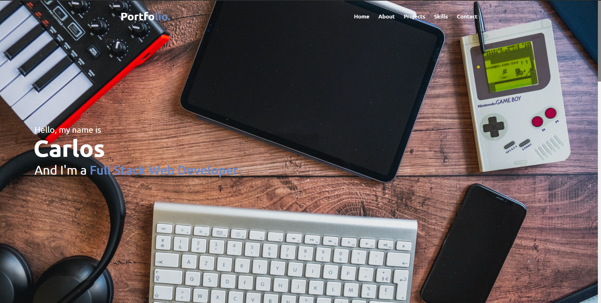

# Portfolio

Portfolio made following the Microverse's template where I could showcase all my projects and knowledge achieved during the HTML, CSS, Ruby, and Ruby on Rails Curriculum



## Built With

- HTML
- CSS

## Live Demo

[Portfolio](https://carloso0114.github.io/myportfolio/)


## Getting Started

To get a local copy up and running follow these simple example steps.

## Clone the repository

```
   1. git clone https://github.com/carloso0114/myportfolio.git on your command line
   2. open index.html with your favorite browser 
```

### Usage

Open index.html in your browser.

👤 **Carlos Ospina**

- GitHub: [@carloso0114](https://github.com/carloso0114)

- LinkedIn: [Carlos Ospina](https://www.linkedin.com/in/carlosospina/)

## Acknowledments

- CodingNepal for the free template.
- Fontawesome

## 🤝 Contributing

Contributions, issues and feature requests are welcome!

Feel free to check the [issues page](https://github.com/carloso0114/myportfolio/issues).

## Show your support

Give a ⭐️ if you like this project!
